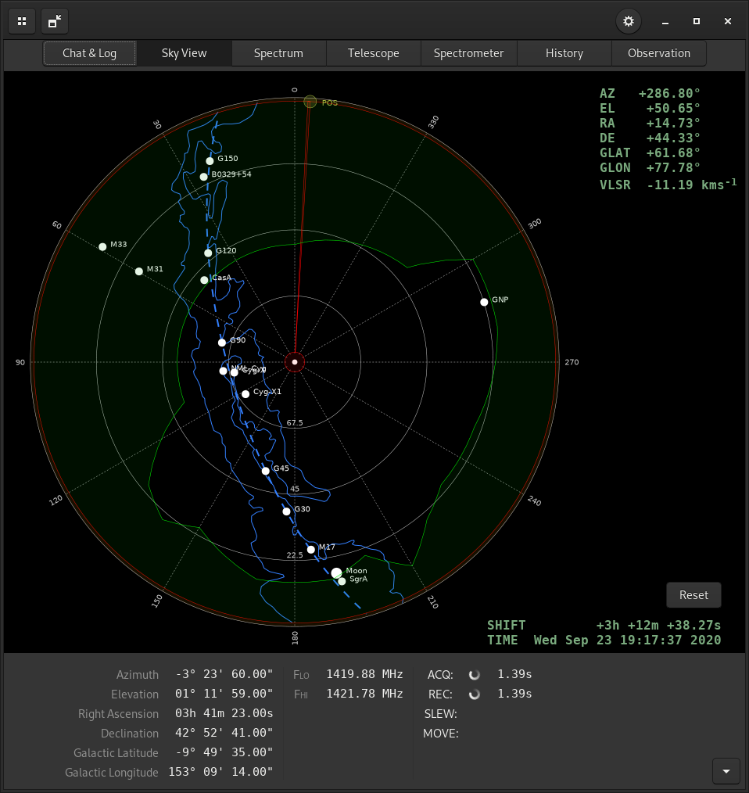
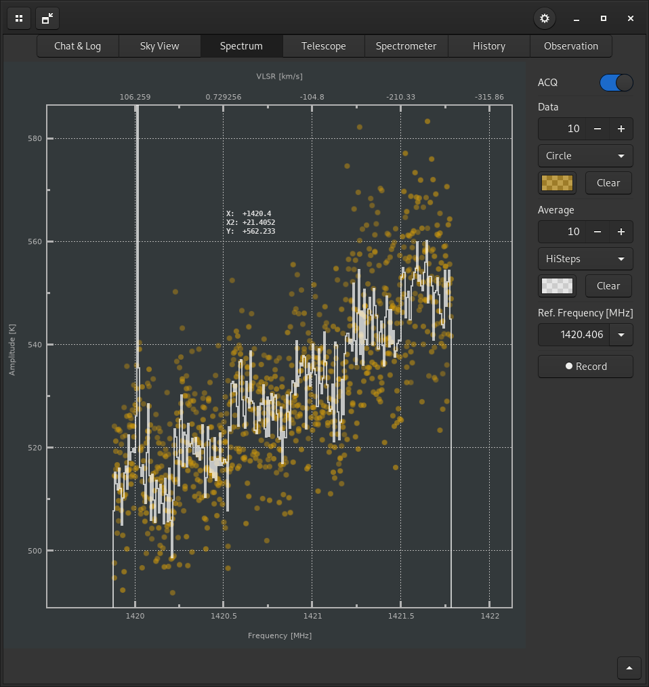
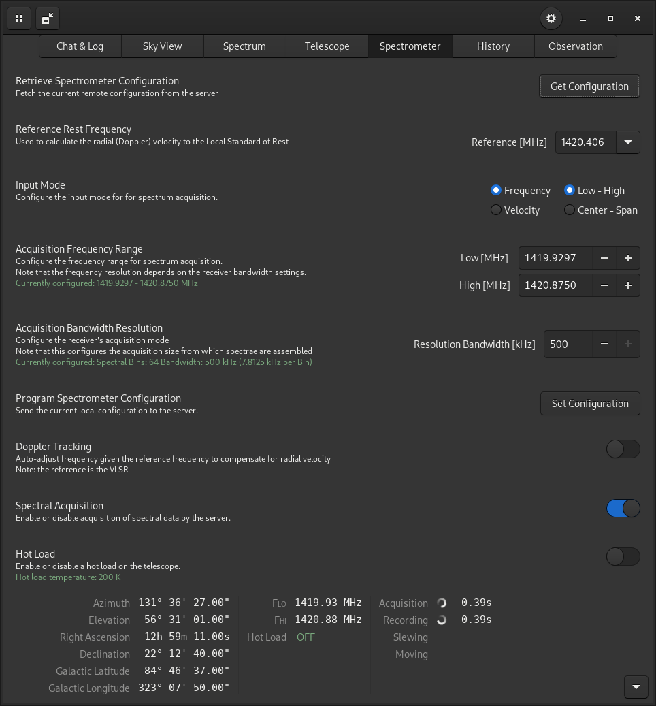
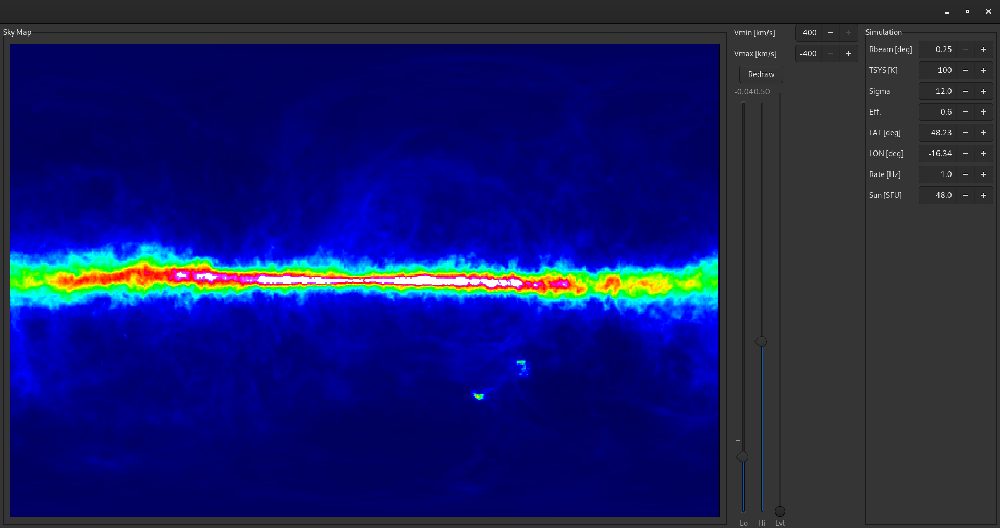

# Overview

This is control software intended for small radio telescopes, such as the 
[Haystack Old SRT](https://wikis.mit.edu/confluence/display/SRT)
or [New SRT](https://www.haystack.mit.edu/haystack-public-outreach/srt-the-small-radio-telescope-for-education/)

The software is made of two parts: a server and a client. The server is
plugin-based and must be supplied with the implementation of the control logic
for the particular hardware configuration.

Currently, the only hardware plugins supplied here are for used with the
*Old SRT* (CASSI mount, digital receiver model). It is highly recommended
you update the STAMP controller with the firmware with fractional count support
[SRT Memo 22](https://www.haystack.mit.edu/wp-content/uploads/2020/07/memo_SRT_022.pdf).

Plugins for the SPID Elektronik Big RAS drive and MD01 controller, as well
as the Measurement Computing PCI-DAS4020/12 A/D converter are currently in a
rudimentary state and will be added some time in the future.

A radio telescope simulator plugin is available and the default configuration
when the software is installed.


# Building and Installation

Follow the usual autotools routine, i.e.


```
./autogen.sh
./configure
make
sudo make install
```

The default configuration of the client software points to the server running
a (modified) *Old SRT* at the Department of Astrophysics at the University of
Vienna. If you want to run the simulator, you must download a HI data file
(*sky_vel.dat.*, available as .gz or .zip) from
[here](https://www.univie.ac.at/radio/files/), **unpack it** and place
it in the **directory** the server is executed from, which in typical UNIX
systems is your home directory, if you launch the server via the desktop icon,
or in the current directory, if you launch it via the console.

If the simulator won't start, make sure to try to launch *radtelsrv* (server/simulator)
from the command line for extra debug info.


## OSX

There is currently no installer for OSX, see HOWTO_OSX for a list of instruction
how to set up a build environment and install the software.

## Windows
You can build this software on Windows via MingW, but you may also download
a pre-built windows installer (.msi-file) [here](https://www.univie.ac.at/radio/files/)

**NOTE:** On Windows, the (extracted) simulator data must be placed in the base
installation directory (usually C:\Program Files\radtel), NOT in the bin/
subdirectory!


## Connecting to the simulator

Once you have manage to successfully install the software and data file,
launch *radtelsrv* (server/simulator) and the client (*radtel*), then configure
the host by clicking *cog wheel* at the right side of the top menubar and
change the *Host* entry to *localhost*, the click the *Reconnect* button
at the bottom of the menu or restart the application.


# How to use the client software

This section will be expanded at a later date. For now there are only basic
pointers.

## General

The buttons in the left corner of the menu bar can be used to disperse and
collect the tabs of the client.

The button with the cog wheel icon opens the configuration menu.

The status field at the botton shows the current status of the telescope,
such as position, slewing or spectral acquisition. It can be hidden by
clicking the expander button in the bottom right corner of the window.

## Chat and Log

...should be obvious

## Sky View



This is a map of the currently visibly sky at the location of the remote
telescope in polar projection, with north at 0 and south at 180 degrees
(on the northern hemisphere). The zenith is the center of the diagram.
The dashed blue line and solid outline represent the plane and
approximate outline of the Milky May. Circles indicate catalogue objects.
The red line indicates the physical movement limits of the telescope, while
the green line (and shaded are) represents the local horizon (building, trees,
etc.)

When the mouse pointer hovers on top of the map, the current coordinate info
below the cursor is printed in the top right.

The time of the projection can be shifted by *right-click and drag*.

*Ctrl + left click* commands the telescope to drive to that position. If a
catalogue object (disk) is clicked in this manner, the telescoped will move
there and in addition, *tracking* will be enabled.

If tracking is enabled, *left-click* anywhere within the sky map will de-select
the object and deactivate tracking.

## Spectrum



If acquisition is enabled, shows current and cumulative average spectra.
The GUI elements should be mostly self-explanatory, here are the key/mouse
bindings:

*left click and drag* to define a zoom box

*scroll wheel* for two-axis zoom

*shift + scroll* for Y-axis zoom

*Ctrl + scroll* for X-axis zoom

*lower case "a"* to autoscale

*Ctrl + left drag* to fit a Gaussian to the selected data

*lower case "u"* deactivates the Gaussian fit box

*alt + click* to define new center frequency for spectrometer

There is also a right-click popup-menu for extra functions.


## Telescope

Configure the telescope position. Click *Get Coordinates* to update the
control fields in this tab with the current status of the remote telescope.
The remaining functions should be obvious if you have used any telescope before.

## Spectrometer



Configure the spectrometer. Click *Get Configuration* to update the
control fields in this tab with the current status of the remote telescope.

The remaining functions will be described in more detail at a later date, but
be warned of one thing: do not set the acquisition frequency range too wide.
This will work without problems with the simulated radio telescope, but
in real systems, spectral acquisition takes time and extreme configurations
can lead to hours of wait time. See the *REC* status field for the ETA
of the next spectrum. If it is excessive, you may have misconfigured the system.
In such a situation, you should scroll/go to the bottom of the tab and
deactivate *Spectral Acquisition*, then reconfigure the *Acquisition Frequency Range*
to a much smaller (typically a few MHz) bandwidth and re-enable.


## History

The plot on the top will show the *continuum vales* (integral) of
previously recorded spectra, the waterfall diagram on the bottom will show a
colour-coded spectral history. You can use the level slider on the right
to somewhat adjust the colour cutoff.


## Observation

These are automated observation programs. Their function will be described at
a later date. You're welcome to find out yourself tho.


# How to use the server software

## Simulated Telescope
In the default configuration, a radio telescope simulator plugin is enabled
and will show you a control interface once started.




To the left, you see an image of the HI emissions of the Milky Way given the
current configuration of the telescope. You can modify the colour cuts of the
image by changing the sliders just to the right. If you want to set
cuts in the VLSR, change *Vmin* and *Vmax*, the click *Redraw*. Note that
this will only influence the data range from which the displayed image
is generated, but never cut off the simulated data generation range,
which will always range from +400 to -400 km/s.

To change the simulation parameters, refer to the entry fields on the right.
Any change to an entry (either via the range buttons or manually followed by
enter key/changing the field) will result in the immediate reconfiguration
of the simulated telescope.

*Rbeam* sets the simulated beam radius for the simulated resolution

*TSYS* sets the system temperature

*Sigma* sets the amount of simulated nose

*Eff.*  is the efficiency of the telescope.

*LAT* and *LON* set the geographical location of the telescope

*Rate* sets the simulated spectra per second

*Sun* sets the current radio flux density from the sun.

*Hot Load* sets the temperature of the simulated hot load calibrator

*Noise Fig.* sets the noise figure of the simulated amplifier chain


## Actual Hardware
The server configuration for actual hardware can be a bit tricky. If you own
one of the Haystack SRTs, you're welcome to mail me for some help.


# Experimental Features

If you'd like to try the freely programmable observation mode implemented
via [GtkNodes](https://github.com/aluntzer/gtknodes), install the library
and build the client from the *gtknodes* branch.

You will find the *Node Editor* in the *Observation* tab. To show the available
nodes, right-click the node view for a popup-menu.

